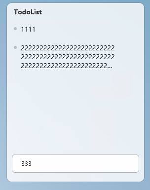
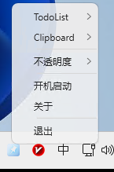

# WinKit - 极致精美的现代 Windows 效率工具箱 🚀

`WinKit` 是一款专为 Windows 11 设计的、极致轻量且美观的效率工具箱。它将 **TodoList (待办工具)** 与 **Clipboard (高级剪切板)** 深度整合，采用高档磨砂半透明（毛玻璃）视觉体系，并自研了 100% 贴合 Windows 11 Fluent 风格的系统托盘右键菜单。

---

## 📸 界面预览

| 待办清单 (TodoList) | 剪贴板历史 (Clipboard) | 托盘右键菜单与设置 |
| :---: | :---: | :---: |
|  |  |  |

---

## ✨ 核心特性

### 1. 📂 TodoList (待办清单)
* **无干扰悬浮窗**：常驻桌面，支持鼠标拖拽调整位置与大小。
* **快捷状态控制**：一键开启“置顶显示”或“鼠标穿透”（穿透后不干扰桌面正常操作）。
* **轻量本地持久化**：待办条目采用标准 Markdown 格式实时同步至本地 `%AppData%\WinKit\todos.md`，方便多端同步与查看。
* **双击快速交互**：双击列表空白处即可轻松添加新待办，双击已完成条目即可一键删除。

### 2. 📋 Clipboard (剪贴板历史)
* **系统级拦截 (`Win + V`)**：全局低级键盘钩子接管原生剪贴板，弹出本工具专属的历史窗口，并聚焦到列表。
* **开始菜单防弹 Bug 修复**：独创 `0xFF` 虚拟击键防骚扰机制，彻底解决了拦截 `Win` 组合键时系统容易误弹出“开始菜单”的痛点。
* **极致轻量界面**：去除了累赘的搜索框，背景不透明度支持 40% ~ 100% 多档个性化调节（默认 **80%**），提供高对比度的文字排版。
* **双击自动粘贴 (回填)**：双击历史条目即可自动复制、隐藏窗口、并在 80ms 后模拟 `Ctrl + V` 物理击键，将文本直接填入原焦点输入框中。
* **隐私监听开关**：支持在托盘子菜单中一键“开启/关闭监听”，保障敏感工作环境的隐私安全。

### 3. 🎨 现代自研 Fluent 托盘右键菜单
* **WPF 上下文菜单接管**：彻底弃用 WinForms 的陈旧菜单，采用 WPF 自研设计系统，带来 8px 圆角、微透明磨砂白底色 (#F2F5F5F5)、高档投影与 hover 动态高亮。
* **完美的失焦自动关闭**：引入了常驻后台的 0x0 像素焦点宿主窗口 `MenuHostWindow`。当菜单弹出时，该窗口被置于前台；一旦您在屏幕其他任意区域点击，菜单会瞬间百分之百灵敏合起，无任何闪退。
* **精致间距微调**：第一列宽度缩窄至 `18px`，标题左间距收缩至 `6px`，整体文字排版向左紧凑推移了 14 像素，视觉效果极为匀称。

### 4. 🎨 窗口不透明度自定义调节
* **多档自由切换**：支持在托盘右键菜单中快速选择 **40% / 60% / 70% / 80% / 90% / 100%** 不透明度档位。
* **即时保存生效**：所有窗口背景色随选中档位即时刷新，配置自动保存并支持开机自动加载。

---

## 🛠️ 下一步开发计划 (Roadmap)

在后续的版本中，我计划为 `WinKit` 深度融入一个**全能型的高效截图工具**。

因为目前市面上的截图工具功能大多较为单一，极少有能够完美兼顾以下所有痛点需求的独立工具（QQ 截图虽好，但必须依赖 QQ 客户端常驻运行，脱离使用极不方便）：
1. 📸 **基础截图功能**：支持框选、马赛克、画笔、箭头等常用标注。
2. 📌 **贴图/钉图 (Pin)**：将截图以置顶悬浮窗形式钉在桌面上，方便多窗口对照开发、对照文档或记笔记。
3. 📝 **OCR 提取文字**：一键识别并提取截图中的文字（目前仍在“在线接口（高准确率）”与“离线本地识别（完全私密无需联网）”的实现方案之间进行权衡和纠结，尚未敲定最终技术路线）。
4. 🌐 **截图翻译 (刚需)**：自动识别截图中的外语并直接完成就地翻译，彻底打通跨国文档阅读和代码查阅的痛点（同样处于“离线翻译 vs 在线翻译”的架构方案评估阶段）。

欢迎大家提出宝贵意见或进行组件推荐，让我们共同打造一个无需依赖任何臃肿聊天软件的、独立且极致好用的截图利器！

---

## 🖥️ 系统要求与版本选择

* **操作系统**：Windows 10 / 11（64 位）

| 版本名称 | 内置依赖 | 适用场景与特点 |
| :--- | :--- | :--- |
| **独立免装版** (Standalone) | 无，双击即用 | **开箱即用**。内置了整个 .NET 8.0 运行库，即使您的电脑没有配置过开发环境，也能直接双击启动，非常方便。 |
| **极致精简版** (Lite) | 需预装 [.NET 8 Desktop Runtime](https://dotnet.microsoft.com/download/dotnet/8.0) | **极速轻巧**。不含任何冗余运行时，程序体积仅几百 KB 级别，适合极客及已安装过运行库的用户。 |

## 💾 下载地址

您可以通过以下渠道下载预编译好的二进制可执行文件：

1. **蓝奏云下载 (国内加速)**：[点击下载](https://li5bo5.lanzouu.com/b00egskkqb) (提取密码: `Wink`)
2. **GitHub Releases**：[GitHub 发行版页面](https://github.com/li5bo5/WinKit/releases)

---

## 💻 编译与发布指南

在项目根目录下执行以下命令，即可在本地编译并打包输出这两个版本：

```powershell
# 1. 编译并打包：极致精简版 (Lite)
# 文件将输出至项目根目录的 Publish_Releases\Lite\ 文件夹中
dotnet publish -c Release -r win-x64 --self-contained false -p:PublishSingleFile=true -p:PublishReadyToRun=true -o Publish_Releases\Lite

# 2. 编译并打包：独立免装版 (Standalone)
# 文件将输出至项目根目录的 Publish_Releases\Standalone\ 文件夹中
dotnet publish -c Release -r win-x64 --self-contained true -p:PublishSingleFile=true -p:PublishReadyToRun=true -o Publish_Releases\Standalone
```

---

## 📄 开源协议

本项目采用 **AGPL-3.0 (GNU Affero General Public License v3.0)** 协议开源。
