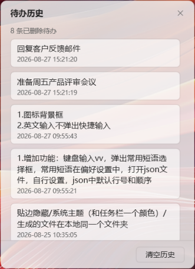
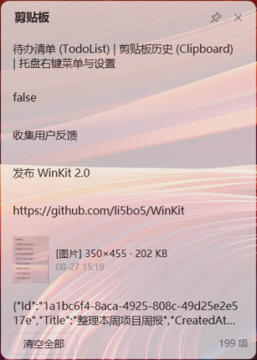

# WinKit - 极致精美的现代 Windows 效率工具箱 🚀

`WinKit` 是一款专为 Windows 设计的、极致轻量且美观的效率工具箱。它将 **TodoList (待办工具)**、**Clipboard (高级剪贴板)** 与 **Quick Phrases (常用短语)** 深度整合，采用高档磨砂半透明（毛玻璃）视觉体系，并自研了 100% 贴合 Windows 11 Fluent 风格的系统托盘右键菜单。

---

## 📸 界面预览

| 待办清单 | 待办历史 | 剪贴板 | 常用短语 | 偏好设置 |
| :---: | :---: | :---: | :---: | :---: |
|  |  |  |  |  |

---

## 📸使用视频

Bilibili ：【集待办清单与剪贴板于一体的Win11工具箱！ 轻量、现代、美观、专注效率！-哔哩哔哩】 https://b23.tv/tLUjxVI

---

## ✨ 核心特性

### 1. 📝 待办清单 (TodoList)
* **主要功能**：桌面常驻轻量待办，支持多行展开、拖拽排序、完成归档、回收站自愈备份与鼠标完全穿透。
* **操作方式**：
  * **新增待办**：点击右上角 `＋` 按钮输入待办；编辑时按 `Ctrl + S` 保存并退出。
  * **完成与删除**：点击条目左侧圆圈标记完成；悬停条目点击右侧 `🗑` 移入待办历史。
  * **置顶切换**：点击右上角 `📌` 按钮或按下全局快捷键 `Ctrl + D` 切换置顶。
  * **穿透模式**：点击右上角 `⊙` 开启完全穿透（只看不可点，不阻挡下层应用操作）；按下 `Ctrl + D` 或在偏好设置中一键关闭穿透。
  * **拖动与缩放**：按住顶部标题栏拖动位置；拖动右下角三角控制点自由调节窗口大小。

### 2. 🗑️ 待办历史 (Recycle Bin)
* **主要功能**：安全保存已删除的待办历史，防止误删，支持超时自动清理（默认保留 60 天）。
* **操作方式**：
  * **打开历史**：右键系统托盘图标，在菜单中选择「待办历史」。
  * **恢复待办**：点击条目右侧 `⟲` 还原按钮，按原顺序恢复回待办清单。
  * **彻底删除**：点击单条垃圾桶图标彻底删除，或点击右上角「清空全部」重置回收站。

### 3. 📋 高级剪贴板 (Clipboard)
* **主要功能**：自动监听并记录复制的文本与图片，支持搜索筛选、最新覆盖去重、窗口固定与图片缓存生命周期管理。
* **操作方式**：
  * **唤出与关闭**：按下全局快捷键 `Win + V` 唤出剪贴板面板；按 `Esc` 或点击窗口外部自动隐藏。
  * **快速粘贴**：鼠标左键单击列表项，自动回填粘贴至当前焦点应用（同时保持当前滚动位置，方便连续查阅）。
  * **搜索与置顶**：在上方搜索框直接键入关键词实时过滤；点击右上角 `📌` 固定窗口置顶不自动关闭。
  * **单项管理**：悬停条目点击 `🗑` 删除单条，或点击右上角「清空」一键清除历史。

### 4. 💬 常用短语 (Quick Phrases)
* **主要功能**：在任意输入框通过按键快速唤出常用短语列表并一键回填，智能兼容中文输入法不误触。
* **操作方式**：
  * **闪电唤出**：在任意软件的文本输入框中快速连按两次小写字母 `vv`，即在光标处弹出短语面板。
  * **选择回填**：使用方向键 `↑` / `↓` 选择并回车，或直接鼠标左键单击目标短语瞬间回填。
  * **短语库管理**：在偏好设置中点击「编辑」可直接用记事本自定义短语库，点击「重置」恢复默认短语。

### 5. ⚙️ 统一偏好设置 (Preferences)
* **主要功能**：一站式集中管理快捷键录入、穿透模式、主题外观、窗口不透明度、双击托盘行为及保留周期。
* **操作方式**：
  * **打开设置**：右键系统托盘图标，选择「偏好设置」。
  * **快捷键录入**：点击目标输入框，直接按下键盘上的物理组合键自动捕获录入。
  * **模式切换**：支持开关「穿透模式」、切换颜色主题（跟随系统/浅色/深色）、调节窗口不透明度等。
  * **保存生效**：点击底部「保存配置」即时应用并全局广播。

---

## 📂 数据与配置文件存储位置（纯绿色便携免安装）

WinKit 采用绿色便携化设计，所有数据与配置文件均统一存放在**应用程序运行所在目录**下的 `Data` 文件夹中，彻底不向系统其他位置散落任何文件。

* **数据保存目录**：`[WinKit.exe 所在目录]\Data\`

### 文件结构清单

| 文件名 / 目录 | 用途说明 |
| :--- | :--- |
| **`settings.json`** | 全软件统一配置文件（存储主题、快捷键、透明度、保留天数等偏好设置） |
| **`todos.jsonl`** | 待办清单数据文件（存储待办内容、创建时间与状态） |
| **`recycle_bin.jsonl`** | 待办历史/回收站数据文件（存储已删除的待办历史记录） |
| **`clipboard.jsonl`** | 剪贴板历史数据文件（存储已复制的历史文本与记录） |
| **`quick_phrases.jsonl`** | 常用短语库数据文件（存储快捷短语列表） |
| **`Images/`** | 剪贴板图片缓存目录（本地存储剪贴板捕获的图片文件） |

> 💡 **绿色迁移提示**：如需备份数据或迁移至新电脑，只需将整个 WinKit 文件夹（包含 `Data` 目录）复制到任意位置即可 100% 完整迁移。每个数据文件均内置 `.bak` 损坏自愈备份机制。

---

## 🖥️ 系统要求与版本选择

* **操作系统**：Windows 10 / 11（64 位）

| 版本名称 | 内置依赖 | 适用场景与特点 |
| :--- | :--- | :--- |
| **独立免装版** (Self-Contained) | 无，双击即用 | **开箱即用**。内置了完整 .NET 8.0 运行库，无环境要求。 |
| **框架依赖版** (Framework-Dependent) | 需预装 [.NET 8 Desktop Runtime](https://dotnet.microsoft.com/download/dotnet/8.0) | **极速轻巧**。体积小巧，适合已安装过 .NET 8 运行库的用户。 |

---

## 💻 编译与发布指南

在项目根目录下执行以下命令，即可在本地打包输出 Release 版本：

```powershell
# 1. 编译并打包：框架依赖版 (Framework-Dependent)
dotnet publish WinKit.csproj -c Release -r win-x64 --self-contained false -o bin\Publish\FrameworkDependent_V2.5

# 2. 编译并打包：独立免装版 (Self-Contained)
dotnet publish WinKit.csproj -c Release -r win-x64 --self-contained true -o bin\Publish\SelfContained_V2.5
```

---

## 💾 下载地址

您可以通过以下渠道下载预编译好的二进制可执行文件：

1. **蓝奏云下载 (国内加速)**：[点击下载](https://li5bo5.lanzouu.com/b00egskkqb) (提取密码: `Wink`)
2. **GitHub Releases**：[GitHub 发行版页面](https://github.com/li5bo5/WinKit/releases)

---

## Star History

<a href="https://www.star-history.com/?repos=li5bo5%2FWinKit&type=date&legend=top-left">
 <picture>
   <source media="(prefers-color-scheme: dark)" srcset="https://api.star-history.com/chart?repos=li5bo5/WinKit&type=date&theme=dark&legend=top-left&sealed_token=QByHdIhs51DixtP469uzjKFznxRO-qV_XhxKR7kkNTtP7ZHYk_JpfQAjkDARmwEGZb1M_d1sGLvXswrsBwyCzJ02PGI-ds1ui20xR5rwEboA9oGnLlrXhx81b5Kkxul94oO-eouIdytDTDH5JZh7uXJX5EEFnuAw9J5FCwGb7zYVsyw_i-65UYXJKNor" />
   <source media="(prefers-color-scheme: light)" srcset="https://api.star-history.com/chart?repos=li5bo5/WinKit&type=date&legend=top-left&sealed_token=QByHdIhs51DixtP469uzjKFznxRO-qV_XhxKR7kkNTtP7ZHYk_JpfQAjkDARmwEGZb1M_d1sGLvXswrsBwyCzJ02PGI-ds1ui20xR5rwEboA9oGnLlrXhx81b5Kkxul94oO-eouIdytDTDH5JZh7uXJX5EEFnuAw9J5FCwGb7zYVsyw_i-65UYXJKNor" />
   
 </picture>
</a>

---

## 📄 开源协议

本项目采用 **AGPL-3.0 (GNU Affero General Public License v3.0)** 协议开源。
