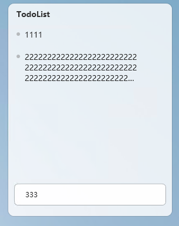
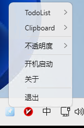

# WinKit - 极致精美的现代 Windows 效率工具箱 🚀

`WinKit` 是一款专为 Windows 11 设计的、极致轻量且美观的效率工具箱。它将 **TodoList (待办工具)** 与 **Clipboard (高级剪切板)** 深度整合，采用高档磨砂半透明（毛玻璃）视觉体系，并自研了 100% 贴合 Windows 11 Fluent 风格的系统托盘右键菜单。

---

## 📸 界面预览

| 待办清单 (TodoList) | 剪贴板历史 (Clipboard) | 托盘右键菜单与设置 |
| :---: | :---: | :---: |
|  |  |  |

---

## ✨ 核心特性 (v2.0)

### 1. 📂 TodoList (待办清单)
* **无干扰悬浮窗**：常驻桌面，支持鼠标拖拽调整位置与大小。屏蔽操作系统 Aero Snap 贴边分屏拖拽干扰。
* **快捷状态控制**：一键开启“置顶显示”或“鼠标穿透”（穿透后不干扰桌面正常操作）。
* **待办历史记录**：删除或清空编辑框待办时，自动移入“历史记录”（包含删除时间 + 原始内容），支持通过托盘菜单随时查看与恢复。
* **轻量本地持久化**：待办条目采用标准 Markdown 格式实时同步至本地 `%AppData%\WinKit\todos.md`。

### 2. 📋 Clipboard (剪贴板历史)
* **无焦点弹窗 (`Win + V`)**：弹出无焦点悬浮面板，**在资源管理器重命名文件时按 Win+V 绝不上夺焦点，重命名编辑框不中断**。
* **置顶显示控制**：窗口标题栏右上角配备置顶按钮（📌 / 📍），开启置顶后失焦不隐藏。
* **滚动位置记忆**：托盘提供“记忆滚动”配置开关。默认未开启时，每次打开自动复位显示顶部第一条；开启后记忆上次滚动位置。
* **双击自动粘贴 (回填)**：选定历史条目即可自动复制并隐藏窗口，模拟 `Ctrl + V` 物理击键回填至原输入框。

### 3. 🎨 现代自研 Fluent 托盘右键菜单
* **WPF 上下文菜单接管**：采用 WPF 自研设计系统，带 8px 圆角、微透明磨砂白底色 (#F2F5F5F5)、高档投影与 hover 动态高亮。
* **层级结构**：TodoList 菜单整合“显示/隐藏/置顶/鼠标穿透/历史记录”，Clipboard 菜单整合“显示历史/清空历史/启用去重/记忆滚动/启用监控”。
* **失焦自动关闭**：后台 0x0 像素焦点宿主窗口 `MenuHostWindow` 确保在桌面任意区域点击时菜单瞬间合起。

### 4. 🎨 窗口不透明度自定义调节
* **多档自由切换**：支持在托盘右键菜单中快速选择 **40% / 60% / 70% / 80% / 90% / 100%** 不透明度档位。

---

## 🛠️ 下一步开发计划 (Roadmap)

在后续的版本中，我计划为 `WinKit` 深度融入一个**全能型的高效截图工具**：
1. 📸 **基础截图功能**：支持框选、马赛克、画笔、箭头等常用标注。
2. 📌 **贴图/钉图 (Pin)**：将截图以置顶悬浮窗形式钉在桌面上，方便多窗口对照开发。
3. 📝 **OCR 提取文字**：一键识别并提取截图中的文字。
4. 🌐 **截图翻译**：自动识别截图中的外语并直接完成就地翻译。

---

## 🖥️ 系统要求与版本选择

* **操作系统**：Windows 10 / 11（64 位）

| 版本名称 | 内置依赖 | 适用场景与特点 |
| :--- | :--- | :--- |
| **独立免装版** (Self-Contained) | 无，双击即用 | **开箱即用**。内置了完整 .NET 8.0 运行库，无环境要求。 |
| **框架依赖版** (Framework-Dependent) | 需预装 [.NET 8 Desktop Runtime](https://dotnet.microsoft.com/download/dotnet/8.0) | **极速轻巧**。体积小巧，适合已安装过 .NET 8 运行库的用户。 |

---

## 💾 下载地址

您可以通过以下渠道下载预编译好的二进制可执行文件：

1. **蓝奏云下载 (国内加速)**：[点击下载](https://li5bo5.lanzouu.com/b00egskkqb) (提取密码: `Wink`)
2. **GitHub Releases**：[GitHub 发行版页面](https://github.com/li5bo5/WinKit/releases)

---

## 💻 编译与发布指南

在项目根目录下执行以下命令，即可在本地打包输出 Release 版本：

```powershell
# 1. 编译并打包：框架依赖版 (Framework-Dependent)
dotnet publish WinKit.csproj -c Release -r win-x64 --self-contained false -o bin\Publish\FrameworkDependent_V2.0

# 2. 编译并打包：独立免装版 (Self-Contained)
dotnet publish WinKit.csproj -c Release -r win-x64 --self-contained true -o bin\Publish\SelfContained_V2.0
```

---

## Star History

<a href="https://www.star-history.com/?repos=li5bo5%2FWinKit&type=date&legend=top-left">
 <picture>
   <source media="(prefers-color-scheme: dark)" srcset="https://api.star-history.com/chart?repos=li5bo5/WinKit&type=date&theme=dark&legend=top-left&sealed_token=QByHdIhs51DixtP469uzjKFznxRO-qV_XhxKR7kkNTtP7ZHYk_JpfQAjkDARmwEGZb1M_d1sGLvXswrsBwyCzJ02PGI-ds1ui20xR5rwEboA9oGnLlrXhx81b5Kkxul94oO-eouIdytDTDH5JZh7uXJX5EEFnuAw9J5FCwGb7zYVsyw_i-65UYXJKNor" />
   <source media="(prefers-color-scheme: light)" srcset="https://api.star-history.com/chart?repos=li5bo5/WinKit&type=date&legend=top-left&sealed_token=QByHdIhs51DixtP469uzjKFznxRO-qV_XhxKR7kkNTtP7ZHYk_JpfQAjkDARmwEGZb1M_d1sGLvXswrsBwyCzJ02PGI-ds1ui20xR5rwEboA9oGnLlrXhx81b5Kkxul94oO-eouIdytDTDH5JZh7uXJX5EEFnuAw9J5FCwGb7zYVsyw_i-65UYXJKNor" />
   
 </picture>
</a>

---

## 📄 开源协议

本项目采用 **AGPL-3.0 (GNU Affero General Public License v3.0)** 协议开源。
